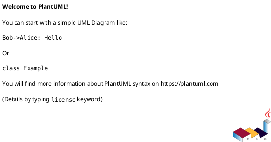
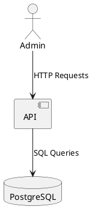
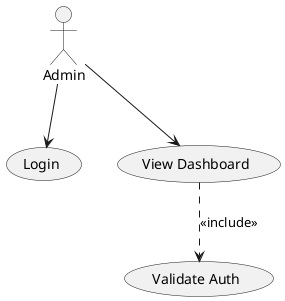

# PlantUML Syntax Guide for Attendeely Diagrams

This guide explains the PlantUML syntax used in the diagram files for the Attendeely project.

## What is PlantUML?

PlantUML is a tool that allows you to create UML diagrams using a simple, text-based syntax. You can render PlantUML diagrams using:
- Online editor: http://www.plantuml.com/plantuml/uml/
- VS Code extension: PlantUML extension
- Command line tool
- CI/CD pipelines

## File Structure

The project includes 5 PlantUML files:
1. `context-diagram.puml` - System context and external entities
2. `usecase-diagram.puml` - Use cases for all actors
3. `sequence-diagram.puml` - Sequence diagrams for key workflows
4. `class-diagram.puml` - Database models and relationships
5. `architectural-design.puml` - System architecture diagrams

## Basic PlantUML Syntax

### Starting and Ending Diagrams



### Comments

```plantuml
' Single line comment
/'
Multi-line comment
'/
```

### Themes and Styling

```plantuml
!theme plain
skinparam componentStyle rectangle
skinparam linetype ortho
```

## Context Diagram Syntax

### Actors

```plantuml
actor "Actor Name" as ActorAlias
```

### Components

```plantuml
component [Component Name] as ComponentAlias {
    component [Sub Component] as SubComponent
}
```

### Packages (System Boundaries)

```plantuml
package "Package Name" {
    component [Component] as Comp
}
```

### Relationships

```plantuml
Actor --> Component : Label
Component --> Component : Label
```

### Notes

```plantuml
note right of Component
  Note text here
end note
```

### Example



## Use Case Diagram Syntax

### Actors

```plantuml
actor "Actor Name" as ActorAlias
```

### Use Cases

```plantuml
usecase "Use Case Name" as UC_Alias
```

### Packages (Grouping)

```plantuml
package "Package Name" {
    usecase "Use Case" as UC1
}
```

### Relationships

```plantuml
Actor --> UseCase : Association
UseCase ..> (Include) : <<include>>
UseCase ..> (Extend) : <<extend>>
```

### Notes

```plantuml
note right of UseCase
  Note text
end note
```

### Example



## Sequence Diagram Syntax

### Participants

```plantuml
actor "Actor Name" as ActorAlias
participant "Participant Name" as PartAlias
database "Database Name" as DBAlias
```

### Messages

```plantuml
Actor -> Participant : Synchronous Message
Actor --> Participant : Asynchronous Message
Participant -> Participant : Return Message
```

### Activation Boxes

```plantuml
activate Participant
' ... messages ...
deactivate Participant
```

### Alt Blocks (Conditional)

```plantuml
alt Condition
    Participant -> Participant : Message if true
else Other Condition
    Participant -> Participant : Message if false
end
```

### Loop Blocks

```plantuml
loop For Each Item
    Participant -> Participant : Message
end
```

### Notes

```plantuml
note right of Participant
  Note text
end note
```

### Example

```plantuml
@startuml Sequence
actor User
participant API
database DB

User -> API: Request
activate API
API -> DB: Query
activate DB
DB --> API: Results
deactivate DB
API --> User: Response
deactivate API
@enduml
```

## Class Diagram Syntax

### Classes

```plantuml
class ClassName {
  +attribute: Type
  -privateAttribute: Type
  #protectedAttribute: Type
  --
  +method(): ReturnType
}
```

### Enumerations

```plantuml
enum EnumName {
  VALUE1
  VALUE2
  VALUE3
}
```

### Relationships

```plantuml
' One-to-One
Class1 ||--|| Class2 : "relationship name"

' One-to-Many
Class1 ||--o{ Class2 : "relationship name"

' Many-to-One
Class1 }o--|| Class2 : "relationship name"

' Many-to-Many
Class1 }o--o{ Class2 : "relationship name"
```

### Relationship Labels

```plantuml
Class1 ||--|| Class2 : "label"
Class1 ||--o{ Class2 : "label"
```

### Notes

```plantuml
note right of ClassName
  Note text
end note
```

### Example

```plantuml
@startuml Class
class User {
  +id: Integer
  +email: String
  --
  +login(): Token
}

class Organization {
  +id: Integer
  +name: String
}

User ||--|| Organization : "admin_id"
@enduml
```

## Component Diagram Syntax

### Components

```plantuml
component [Component Name] as CompAlias {
    component [Sub Component] as SubComp
}
```

### Packages

```plantuml
package "Package Name" {
    component [Component] as Comp
}
```

### Relationships

```plantuml
Component1 --> Component2 : Label
Component1 ..> Component2 : Dependency
```

### Example

```plantuml
@startuml Component
package "API Layer" {
    component [Auth API] as AuthAPI
}

package "Service Layer" {
    component [Auth Service] as AuthService
}

AuthAPI --> AuthService : Uses
@enduml
```

## Deployment Diagram Syntax

### Nodes

```plantuml
node "Node Name" {
    component [Component] as Comp
}
```

### Cloud

```plantuml
cloud "Cloud Name" {
    [Service] as Service
}
```

### Database

```plantuml
database "Database Name" as DB {
    component [Storage] as Storage
}
```

### Relationships

```plantuml
Node1 --> Node2 : Connection
```

### Example

```plantuml
@startuml Deployment
node "Server" {
    component [API] as API
}

database "PostgreSQL" as DB

API --> DB : Connects
@enduml
```

## Advanced Features

### Multiple Diagrams in One File

```plantuml
@startuml Diagram1
' First diagram
@enduml

@startuml Diagram2
' Second diagram
@enduml
```

### Colors and Styling

```plantuml
skinparam class {
    BackgroundColor LightBlue
    BorderColor DarkBlue
}
```

### Grouping with Rectangles

```plantuml
rectangle "Group Name" {
    component [Component] as Comp
}
```

### Arrows and Line Styles

```plantuml
A --> B : Solid arrow
A ..> B : Dotted arrow
A -->> B : Dashed arrow
A ->> B : Thick arrow
```

## Common Patterns

### Authentication Flow

```plantuml
actor User
participant API
database DB

User -> API: Login Request
API -> DB: Verify Credentials
DB --> API: User Data
API --> User: JWT Token
```

### CRUD Operations

```plantuml
actor Admin
participant API
database DB

Admin -> API: Create Request
API -> DB: INSERT
DB --> API: Created
API --> Admin: Success Response
```

### Error Handling

```plantuml
User -> API: Request
alt Success
    API --> User: Success Response
else Error
    API --> User: Error Response
end
```

## Rendering PlantUML Diagrams

### Online Editor
1. Go to http://www.plantuml.com/plantuml/uml/
2. Paste your PlantUML code
3. View the rendered diagram
4. Export as PNG, SVG, or PDF

### VS Code Extension
1. Install "PlantUML" extension
2. Open `.puml` file
3. Press `Alt+D` to preview
4. Right-click to export

### Command Line
```bash
# Install PlantUML
# Download plantuml.jar

# Render diagram
java -jar plantuml.jar diagram.puml

# Output formats: PNG, SVG, PDF, EPS
```

### GitHub Integration
PlantUML files can be rendered directly in GitHub if you use the PlantUML extension or render them as images.

## Tips and Best Practices

1. **Use Aliases**: Keep diagram code clean with aliases
   ```plantuml
   actor "Admin/Manager" as Admin
   ```

2. **Group Related Elements**: Use packages to organize
   ```plantuml
   package "Authentication" {
       usecase "Login" as UC1
   }
   ```

3. **Add Notes**: Clarify complex relationships
   ```plantuml
   note right of Component
     Important information
   end note
   ```

4. **Consistent Naming**: Use consistent naming conventions
   - Actors: PascalCase
   - Components: PascalCase
   - Use Cases: UC_ prefix

5. **Keep Diagrams Focused**: Don't overcrowd diagrams
   - Split into multiple diagrams if needed
   - Focus on one aspect per diagram

6. **Use Themes**: Apply consistent styling
   ```plantuml
   !theme plain
   ```

## Resources

- **Official Documentation**: https://plantuml.com/
- **Online Editor**: http://www.plantuml.com/plantuml/uml/
- **Syntax Reference**: https://plantuml.com/guide
- **Examples**: https://real-world-plantuml.com/

## File Descriptions

### context-diagram.puml
Shows the system boundary and external entities (actors, databases, external services). Uses actors, components, packages, and relationships.

### usecase-diagram.puml
Shows all use cases organized by actor and package. Uses actors, use cases, packages, and include/extend relationships.

### sequence-diagram.puml
Contains multiple sequence diagrams for key workflows:
- Admin signup flow
- Employee check-in flow
- Leave request flow
- Subscription payment flow
- Payroll processing flow

### class-diagram.puml
Shows all database models with attributes, relationships, and enumerations. Uses classes, enums, and relationship notation.

### architectural-design.puml
Contains multiple architectural diagrams:
- High-level architecture
- Component diagram
- Deployment diagram
- Request flow diagram
- Security architecture

Each diagram can be rendered independently or together for comprehensive documentation.
